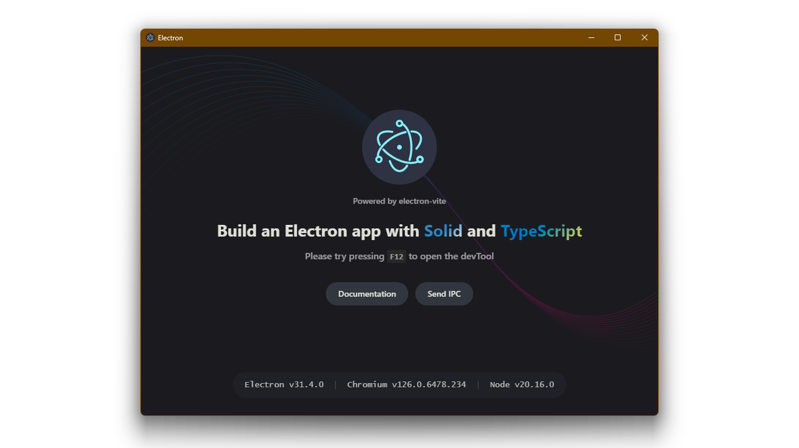

# 📜 Quest CBT

**An Electron application for creating and running Computer Based Test (CBT) on local network.**

<!-- Project Badges -->

![GitHub package.json version](https://img.shields.io/github/package-json/v/coder-newcomer/quest-cbt?logo=data%3Aimage%2Fsvg%2Bxml%3Bbase64%2CPHN2ZyB4bWxucz0iaHR0cDovL3d3dy53My5vcmcvMjAwMC9zdmciIHdpZHRoPSIxZW0iIGhlaWdodD0iMWVtIiB2aWV3Qm94PSIwIDAgMTYgMTYiPjxwYXRoIGZpbGw9IndoaXRlIiBkPSJNNy43NSAxNEExLjc1IDEuNzUgMCAwIDEgNiAxMi4yNXYtOC41QzYgMi43ODQgNi43ODQgMiA3Ljc1IDJoNi41Yy45NjYgMCAxLjc1Ljc4NCAxLjc1IDEuNzV2OC41QTEuNzUgMS43NSAwIDAgMSAxNC4yNSAxNFptLS4yNS0xLjc1YzAgLjEzOC4xMTIuMjUuMjUuMjVoNi41YS4yNS4yNSAwIDAgMCAuMjUtLjI1di04LjVhLjI1LjI1IDAgMCAwLS4yNS0uMjVoLTYuNWEuMjUuMjUgMCAwIDAtLjI1LjI1Wk00LjkgMy41MDhhLjc1Ljc1IDAgMCAxLS4yNzQgMS4wMjVhLjI1LjI1IDAgMCAwLS4xMjYuMjE3djYuNWMwIC4wOS4wNDguMTczLjEyNi4yMTdhLjc1Ljc1IDAgMCAxLS43NTIgMS4yOThBMS43NSAxLjc1IDAgMCAxIDMgMTEuMjV2LTYuNWMwLS42NDkuMzUzLTEuMjE0Ljg3NC0xLjUxNmEuNzUuNzUgMCAwIDEgMS4wMjUuMjc0Wk0xLjYyNSA1LjUzM2EuMjUuMjUgMCAwIDAtLjEyNi4yMTd2NC41YzAgLjA5LjA0OC4xNzMuMTI2LjIxN2EuNzUuNzUgMCAwIDEtLjc1MiAxLjI5OEExLjc1IDEuNzUgMCAwIDEgMCAxMC4yNXYtNC41YTEuNzUgMS43NSAwIDAgMSAuODczLTEuNTE2YS43NS43NSAwIDEgMSAuNzUyIDEuMjk5Ii8%2BPC9zdmc%2B)

![GitHub License](https://img.shields.io/github/license/coder-newcomer/quest-cbt?style=for-the-badge&logo=data%3Aimage%2Fsvg%2Bxml%3Bbase64%2CPHN2ZyB4bWxucz0iaHR0cDovL3d3dy53My5vcmcvMjAwMC9zdmciIHdpZHRoPSIxZW0iIGhlaWdodD0iMWVtIiB2aWV3Qm94PSIwIDAgMTYgMTYiPjxwYXRoIGZpbGw9IndoaXRlIiBkPSJNOC43NS43NVYyaC45ODVjLjMwNCAwIC42MDMuMDguODY3LjIzMWwxLjI5LjczNnEuMDU4LjAzMy4xMjQuMDMzaDIuMjM0YS43NS43NSAwIDAgMSAwIDEuNWgtLjQyN2wyLjExMSA0LjY5MmEuNzUuNzUgMCAwIDEtLjE1NC44MzhsLS41My0uNTNsLjUyOS41MzFsLS4wMDEuMDAybC0uMDAyLjAwMmwtLjAwNi4wMDZsLS4wMDYuMDA1bC0uMDEuMDFsLS4wNDUuMDRxLS4zMTcuMjY1LS42ODYuNDVDMTQuNTU2IDEwLjc4IDEzLjg4IDExIDEzIDExYTQuNSA0LjUgMCAwIDEtMi4wMjMtLjQ1NGEzLjUgMy41IDAgMCAxLS42ODYtLjQ1bC0uMDQ1LS4wNGwtLjAxNi0uMDE1bC0uMDA2LS4wMDZsLS4wMDQtLjAwNHYtLjAwMWEuNzUuNzUgMCAwIDEtLjE1NC0uODM4TDEyLjE3OCA0LjVoLS4xNjJjLS4zMDUgMC0uNjA0LS4wNzktLjg2OC0uMjMxbC0xLjI5LS43MzZhLjI1LjI1IDAgMCAwLS4xMjQtLjAzM0g4Ljc1VjEzaDIuNWEuNzUuNzUgMCAwIDEgMCAxLjVoLTYuNWEuNzUuNzUgMCAwIDEgMC0xLjVoMi41VjMuNWgtLjk4NGEuMjUuMjUgMCAwIDAtLjEyNC4wMzNsLTEuMjg5LjczN2MtLjI2NS4xNS0uNTY0LjIzLS44NjkuMjNoLS4xNjJsMi4xMTIgNC42OTJhLjc1Ljc1IDAgMCAxLS4xNTQuODM4bC0uNTMtLjUzbC41MjkuNTMxbC0uMDAxLjAwMmwtLjAwMi4wMDJsLS4wMDYuMDA2bC0uMDE2LjAxNWwtLjA0NS4wNHEtLjMxNy4yNjUtLjY4Ni40NUM0LjU1NiAxMC43OCAzLjg4IDExIDMgMTFhNC41IDQuNSAwIDAgMS0yLjAyMy0uNDU0YTMuNSAzLjUgMCAwIDEtLjY4Ni0uNDVsLS4wNDUtLjA0bC0uMDE2LS4wMTVsLS4wMDYtLjAwNmwtLjAwNC0uMDA0di0uMDAxYS43NS43NSAwIDAgMS0uMTU0LS44MzhMMi4xNzggNC41SDEuNzVhLjc1Ljc1IDAgMCAxIDAtMS41aDIuMjM0YS4yNS4yNSAwIDAgMCAuMTI1LS4wMzNsMS4yODgtLjczN2MuMjY1LS4xNS41NjQtLjIzLjg2OS0uMjNoLjk4NFYuNzVhLjc1Ljc1IDAgMCAxIDEuNSAwbTIuOTQ1IDguNDc3Yy4yODUuMTM1LjcxOC4yNzMgMS4zMDUuMjczczEuMDItLjEzOCAxLjMwNS0uMjczTDEzIDYuMzI3Wm0tMTAgMGMuMjg1LjEzNS43MTguMjczIDEuMzA1LjI3M3MxLjAyLS4xMzggMS4zMDUtLjI3M0wzIDYuMzI3WiIvPjwvc3ZnPg%3D%3D)
![electron-vite](https://img.shields.io/badge/Made_with-electron--vite-191970.svg?style=for-the-badge&logo=data:image/svg+xml;base64,PHN2ZyB2aWV3Qm94PSIwIDAgMTAyNCAxMDI0IiB2ZXJzaW9uPSIxLjEiIHhtbG5zPSJodHRwOi8vd3d3LnczLm9yZy8yMDAwL3N2ZyIgd2lkdGg9IjY0MCIgaGVpZ2h0PSI2NDAiPjxwYXRoIGQ9Ik0zMjEuNDkwODEyMTQgMTI4Ljc4Nzk2Nzk5VjU0OC42ODUxNDMxNEg0MzMuMTYzMjg3NDV2MzQzLjU1Mjk1MjAzbDI2MC41NzE3NDEwMi00NTguMDcwNjAyNjlINTQ0LjgzODM5NDc0TDY5My43MzU5MDU4MSAxMjguNzg3OTY3OTlIMzIxLjQ5MDgxMjE0eiIgZmlsbD0iI0ZGQUIwMCI+PC9wYXRoPjxwYXRoIGQ9Ik03NS43MjA0NzUyNiA2NDEuNTM1NDE5MTRjMzAuMTQ2NzUxNzggODguNTQ3ODU4NDYgMjUwLjIyODkxODgyIDEwNC41NDI0Mjg5NyA0OTEuMzE0MzIzMDYgMzYuMDA4MTgxNTNzNDEyLjA1NDczODMyLTE5Ni4zMjg1MDU4NCAzODEuODM5NTU0OTQtMjg0Ljg5MTI3ODg4Yy0xOS42MDIxNDQwOC01Ny41NzU1NDA4Mi0xMTguOTc4ODY0NjEtODQuNDYzMDE4MzQtMjUyLjkzMTk2NzAxLTc3LjI5NTI0NjlhNjk3MC42NzQzOTQyOSA2OTcwLjY3NDM5NDI5IDAgMCAwIDk0LjgwNjcxNzg2IDQwLjc4MDg0Njk3IDI0OC43MDIzNjc3NCAyMzQuNDUwMTcxMDQgMTIuNjQ5IDAgMSA0Mi4yNzkzMjM1NyAyMC41NzU5Nzg0bDAuODI5OTUyNDcgMC4xODU5OTM1OWMzNy44NzUxMzU5NSA4LjUwMDQzMjk5IDU4LjA1MTkzMDA0IDIxLjc4ODQ0NTk5IDYxLjIyNTIyNjE2IDMxLjI2MDA4MTI4IDExLjEyMTg4OTY2IDMyLjYwODUzNDc1LTkyLjk5MDY0ODQ5IDE0Ni4xODU2ODk1Ny0zNDUuNjA1OTAwMDMgMjE4LjIyMjIzMTIzLTEzNS4zMzIyNjIzNSAzOC41NDQ1MzczOS0yNzIuNjk2NDE2ODIgNTAuNTU3NzkyNTEtMzU4LjgxNDA3NjE2IDMxLjIzMTEyOTQ1LTM3Ljg3NjAxMzMxLTguNTAxMzEwMy01OC4wNTI4MDczNy0yMS43ODg0NDU5OS02MS4yNDEwMTgwNS0zMS4xOTUxNTg5OS01Ljc4OTQ4ODgxLTE2LjkwMzQ4MjUzIDE5LjMwMjA5Nzg1LTU1LjI3Njk0MDkxIDc5LjQ1OTYxNTU4LTk4LjUxMDc5NzU4IDAuNzYyMzk4Mi0xLjEyOTEyMTM5IDEuNDY5NTI0NzQtMi4zMzg5NTcgMi4yNDU5NjAyLTMuNTMzODc3OTkgMjIuNzkzODY0MTEtMzMuOTYxMzc0ODMgNDQuMDk2MjcwMjYtNjcuMDk1NDI5MTggNjMuNjE2ODIyODQtOTguNDM3OTc5MzNDMTM2LjY2MTQ0NzA4IDQ5My41NjI2MTE5OCA1My45MDQ4MzIxIDU3Ny42NDU3NDcyMSA3NS43MjA0NzUyNiA2NDEuNTM1NDE5MTR6IiBmaWxsPSIjNjk4OEU2Ij48L3BhdGg+PC9zdmc+&logoColor=white)

---

## About

The name was inspired by quest/mission system on RPG games. As being said, you can carry out any test as "quest" that are compatible with the application itself — as being made with Electron, so you can develop them with HTML5 and integrate some functionality with its own derived API.
